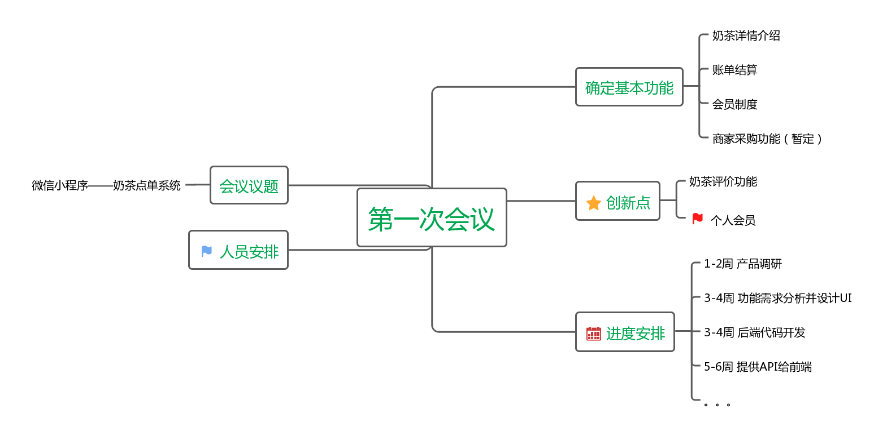

# 项目启动会议
## 微信小程序点餐系统
会议目标：定义产品范围、愿景和核心业务，会议流程及讨论内容：

- 介绍产品调查结果 
  - 点餐因其便利性、高效性在餐饮界逐渐流行起来，市面上有很多扫码点餐软件，例如客如云、思迅、美团等点餐软件，但是它们也存在一定的缺陷，例如菜品评价全部都放在同一块区域，没有针对特定菜品的评价，客户要是想看自己感兴趣的菜品的评价还得从一大堆不相关的评价中找到关于这道菜的评价，有时候还不一定找得到，用户体验十分不好；很多扫码点餐微信小程序没有跟踪用户，不能根据用户之前的订购历史推荐一些类似的菜品。因此，我们小组针对这些问题，提出了一款能做到菜品评论分区、会员跟踪、智能推荐等功能相对完善的扫码点餐系统。
- 产品讨论 
  - 工具：“思维导图”
    - 组织、发现会议的逻辑；控制会议的内容，在内容发散与聚焦之间找平衡；重点标识符勾出你认为（贡献人含自己）最有价值的要点与冲突。（肯定别人提议，凝练议题要点，群面必杀之技）
    ​
  - 确定产品名称：milkTea点餐
  - 定义产品范围：做一款面向微信用户的带有扫码点餐、浏览评论、个性化推荐、线上买单等功能的奶茶点单微信小程序。
  - 候选业务范围：
    - 基本业务：奶茶详情介绍、点单、账单结算
    - 创新业务：分区评价、会员制度
  - 创新点凝练
    - 评价功能做到按菜品评价，而不是完成总订单的总评价
    - 会员制度能做到口味推荐、根据购买记录予以特定会员优惠
- 定义产品 ，按用户，利益、业务故事名称定义产品的服务范围（6~8个业务），第一版本backlog
- 分析涉及的相关技术与潜在风险
- 项目经理总结陈词（分派任务）

## 记录会议"思维导图"
​
by lych
